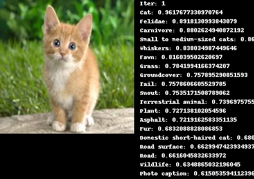
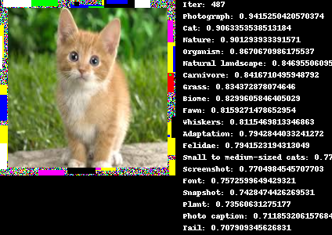
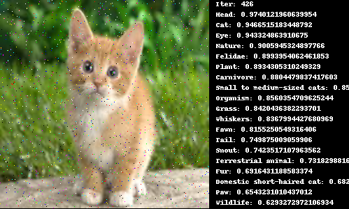
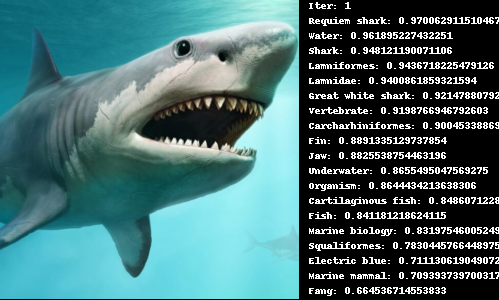

## Sparse-RS attack on Google Vision API.
This fork tries to apply Sparse-RS attack on Google vision API

Checkout my other repos for similar attacks with similar images
- [Square-Attack](https://github.com/kubic71/square-attack)
- [RayS](https://github.com/kubic71/RayS)
- [TREMBA](https://github.com/kubic71/TREMBA)

## Here are some examples
### Original cat image


### Frame 10px


### L0 2000px


### Original shark image


### Frame 20px


### L0 2000px


# Sparse-RS: a versatile framework for query-efficient sparse black-box adversarial attacks

**Francesco Croce, Maksym Andriushchenko, Naman D. Singh, Nicolas Flammarion, Matthias Hein**

**University of Tübingen and EPFL**

**Paper:** [https://arxiv.org/abs/2006.12834](https://arxiv.org/abs/2006.12834)

**A short version is accepted to [ECCV'20 Workshop on Adversarial Robustness in the Real World](https://eccv20-adv-workshop.github.io/)**

## Abstract
Sparse adversarial perturbations received much less attention in the literature compared to L2- and Linf-attacks. 
However, it is equally important to accurately assess the robustness of a model against sparse perturbations. Motivated by this goal, 
we propose a versatile framework based on random search, **Sparse-RS**, for score-based sparse targeted and untargeted attacks in 
the black-box setting. **Sparse-RS** does not rely on substitute models and achieves state-of-the-art success rate and query efficiency 
for multiple sparse attack models: L0-bounded perturbations, adversarial patches, and adversarial frames. Unlike existing methods, the 
L0-version of untargeted **Sparse-RS** achieves almost 100% success rate on ImageNet by perturbing *only* 0.1% of the total 
number of pixels, outperforming all existing white-box attacks including L0-PGD. Moreover, our untargeted **Sparse-RS** achieves very 
high success rates even for the challenging settings of 20x20 adversarial patches and 2-pixel wide adversarial frames for 224x224 
images. Finally, we show that **Sparse-RS** can be applied for universal adversarial patches where it significantly outperforms transfer-based approaches.
<p align="center"></p>


## About the paper
Our proposed **Sparse-RS** framework is based on random search. Its main advantages are its simplicity and its wide applicability 
to multiple threat models:
<p align="center"></p>

We illustrate the versatility of the **Sparse-RS** framework by generating various sparse perturbations: L0-bounded, adversarial patches, and adversarial frames:
<p align="center"></p>
<p align="center"></p>
<p align="center"></p>

**Sparse-RS** also can successfully generate black-box **universal attacks** in sparse threat models without requiring a surrogate model:
<p align="center"></p>

In all these threat models, **Sparse-RS** improves over the existing approaches:
<p align="center"></p>
<p align="center"></p>

Moreover, for L0-perturbations **Sparse-RS** can even outperform existing **white-box** methods such as L0 PGD.
<p align="center"></p>


## Code of Sparse-RS
The code is tested under Python 3.8.5 and PyTorch 1.8.0. It automatically downloads the pretrained models (either VGG-16-BN or ResNet-50) and requires access to ImageNet validation set.

The following are examples of how to run the attacks in the different threat models.

### L0-bounded
In this case `k` represents the number of pixels to modify. For untargeted attacks
```
CUDA_VISIBLE_DEVICES=0 python eval.py --norm=L0 \
	--model=[pt_vgg | pt_resnet] --n_queries=10000 --alpha_init=0.3 \
	--data_path=/path/to/validation/set --k=150 --n_ex=500
```
and for targeted attacks please use `--targeted --n_queries=100000 --alpha_init=0.1`. The target class is randomly chosen for each point.

As additional options the flag `--constant_schedule` uses a constant schedule for `alpha` instead of the piecewise constant decreasing one, while with `--seed=N` it is possible to set a custom random seed.

### Image-specific patches and frames
For untargeted image- and location-specific patches of size 20x20 (with `k=400`)
```
CUDA_VISIBLE_DEVICES=0 python eval.py --norm=patches \
	--model=[pt_vgg | pt_resnet] --n_queries=10000 --alpha_init=0.4 \
	--data_path=/path/to/validation/set --k=400 --n_ex=100
```

For targeted patches (size 40x40) please use `--targeted --n_queries=50000 --alpha_init=0.1 --k=1600`. The target class is randomly chosen for each point.

For untargeted image-specific frames of width 2 pixels (with `k=2`)
```
CUDA_VISIBLE_DEVICES=0 python eval.py --norm=frames \
	--model=[pt_vgg | pt_resnet] --n_queries=10000 --alpha_init=0.5 \
	--data_path=/path/to/validation/set --k=2 --n_ex=100
```

For targeted frames (width of 3 pixels) please use `--targeted --n_queries=50000 --alpha_init=0.5 --k=3`. The target class is randomly chosen for each point.

### Universal patches and frames
For targeted universal patches of size 50x50 (with `k=2500`)
```
CUDA_VISIBLE_DEVICES=0 python eval.py \
	--norm=patches_universal --model=[pt_vgg | pt_resnet] \
	--n_queries=100000 --alpha_init=0.3 \
	--data_path=/path/to/validation/set --k=2500 \
	--n_ex=30 --targeted --target_class=530
```

and for targeted universal frames of width 6 pixels (`k=6`)
```
CUDA_VISIBLE_DEVICES=0 python eval.py \
	--norm=frames_universal --model=[pt_vgg | pt_resnet] \
	--n_queries=100000 --alpha_init=1.667 \
	--data_path=/path/to/validation/set --k=6 \
	--n_ex=30 --targeted --target_class=530
```
The argument `--target_class` specifies the number corresponding to the target label. To generate universal attacks we use batches of 30 images resampled every 10000 queries.

## Visualizing resulting images
We provide a script `vis_images.py` to visualize the images produced by the attacks. To use it please run

```python vis_images --path_data=/path/to/saved/results```
